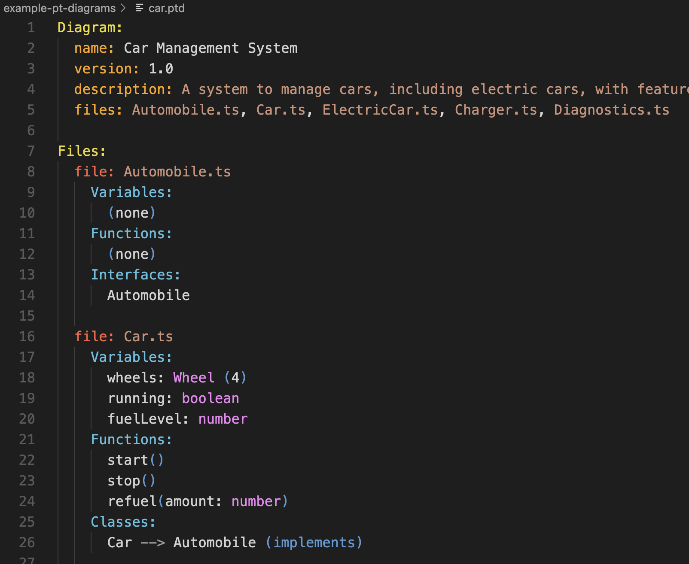

# vscode-pt-diagrams README

This is the README for your extension "vscode-pt-diagrams". After writing up a brief description, we recommend including the following sections.

## Features

Syntax highlighting for `.ptd` files.

PT Diagrams is a simple language for creating diagrams in a text editor. It is inspired by PlantUML and Graphviz, but is much simpler and more focused on the needs of software developers.



## Requirements

Just open a file with a `.ptd` or `.pt-diagram` extension.

## Extension Settings

None

## Known Issues

Some aspects of the syntax highlighting could be improved, like expressions.

Highlighting of brackets inside text descriptions is not perfect. This is because the vscode setting
```
editor.bracketPairColorization.enabled
```
is causing yellow bracket highlighting despite my grammar. In other words, its not the fault of the grammar, but the fault of the vscode setting.

Solution is to disable bracket pair colorization in your settings.json:

```json
"[ptd]": {
    "editor.bracketPairColorization.enabled": false
}
```

## Release Notes

Initial release of PT Diagrams syntax highlighting.

### 0.0.2

Initial release of PT Diagrams syntax highlighting.

### 0.0.1

Alpha release of PT Diagrams syntax highlighting.

---

# PT Diagrams Syntax

## Full Examples

### Example for Recipe Construction

```
Diagram:
  name: Recipe Construction
  version: 1.0
  description: Example of PT (plain text) diagram notation, blending structure (class) and sequence diagramming
  files: Recipe.ts, Fruit.ts, Smoothie.ts

Files:
  file: Recipe.ts
    Variables:
      const ingredients: Fruit[]
      let instructions: string[]
    Functions:
      read(): Fruit[]
      prepare(fruit: Fruit): void
      chop(fruit: Fruit): void
      makeSmoothie(fruit: Fruit): Smoothie
      logRecipe() (private) # private function to log recipe details
    Classes:
      Recipe

  file: Fruit.ts
    Variables:
      const name: string
      const type: string
    Functions:
      getType(): string
      peel(): void
    Classes:
      Fruit

  file: Smoothie.ts
    Variables:
      const ingredients: Fruit[]
      let blended: boolean
    Functions:
      blend(fruit: Fruit): void
      serve(): void
    Classes:
      Smoothie

Classes:
  class: Recipe (Recipe.ts)
    Attributes:
      ingredients: Fruit (0..*)
      instructions: string
    Methods:
      read()
      prepare(fruit: Fruit)
      chop(fruit: Fruit)
      makeSmoothie(fruit: Fruit)
      logRecipe() (private)
      startRecipe()

  class: Fruit (Fruit.ts)
    Attributes:
      name: string
      type: string
    Methods:
      getType()
      peel()

  class: Smoothie (Smoothie.ts)
    Attributes:
      ingredients: Fruit (1..*)
      blended: boolean
    Methods:
      blend(fruit: Fruit)
      serve()


Class Relationships:
  Recipe
    --> Fruit (contains, 1..*)
    --> Smoothie (creates, 1)
  Fruit
    --> Smoothie (ingredient, 1..*)
  Smoothie
    --> Fruit (contains, 1..*)
  Recipe
    --> Smoothie (uses, 1)

Imports:
  Recipe.ts (class Recipe, function read, function prepare)
    --> Fruit.ts (class Fruit, function getType, function peel)
    --> Smoothie.ts (class Smoothie, function blend, function serve)

Use Cases:
  Scenario: Preparation
    startRecipe() [Recipe.ts]
        initializes recipe
        -> read() [Recipe.ts]
            reads ingredients
            -> getType() [class Fruit, Fruit.ts]
                fetches fruit type
                < string
            -> peel() [class Fruit, Fruit.ts]
                peels the fruit
                < void
            < Fruit[]
        -> prepare(fruit: Fruit) [Recipe.ts]
            prepares fruit for chopping
            -> peel() [class Fruit, Fruit.ts]
                peels the fruit
                < void
            < void
        -> chop(fruit: Fruit) [Recipe.ts]
            chops the fruit
            < void
        -> makeSmoothie(fruit: Fruit) [Recipe.ts]
            mixes fruit into smoothie
            -> blend(fruit: Fruit) [class Smoothie, Smoothie.ts]
                blends fruit into smoothie
                < void
            -> serve() [class Smoothie, Smoothie.ts]
                serves the smoothie
                < void
        < Smoothie

  Scenario: Serving
    startRecipe() [Recipe.ts]
        initializes recipe
        -> makeSmoothie(fruit: Fruit) [Recipe.ts]
            mixes fruit into smoothie
            -> blend(fruit: Fruit) [class Smoothie, Smoothie.ts]
                blends fruit into smoothie
                < void
            -> serve() [class Smoothie, Smoothie.ts]
                serves the smoothie
                < void
        < Smoothie
```

### Car Example

Uses advanced scenario sequence diagram features

```
Diagram:
  name: Car Management System
  version: 1.0
  description: A system to manage cars, including electric cars, with features like starting, stopping, charging, and diagnostics.
  files: Automobile.ts, Car.ts, ElectricCar.ts, Charger.ts, Diagnostics.ts

Files:
  file: Automobile.ts
    Variables:
      (none)
    Functions:
      (none)
    Interfaces:
      Automobile

  file: Car.ts
    Variables:
      wheels: Wheel (4)
      running: boolean
      fuelLevel: number
    Functions:
      start()
      stop()
      refuel(amount: number)
    Classes:
      Car --> Automobile (implements)

  file: ElectricCar.ts
    Variables:
      batteryLevel: number
      isCharging: boolean
    Functions:
      start(): void @override
      charge(duration: number)
      checkBattery(): number
    Classes:
      ElectricCar --> Car (inherits)

  file: Charger.ts
    Variables:
      powerOutput: number
      isPluggedIn: boolean
    Functions:
      plugIn()
      unplug()
      chargeCar(car: ElectricCar, duration: number)
    Classes:
      Charger

  file: Diagnostics.ts
    Variables:
      lastError: string
    Functions:
      runDiagnostics(car: Car)
      logError(error: string)
    Classes:
      Diagnostics

Classes:
  interface: Automobile
    Methods:
      start()
      stop()

  class: Car --> Automobile (implements)
    Attributes:
      wheels: Wheel (4)
      running: boolean
      fuelLevel: number
    Methods:
      start()
      stop()
      refuel(amount: number)

  class: ElectricCar --> Car (inherits)
    Attributes:
      batteryLevel: number
      isCharging: boolean
    Methods:
      start(): void @override
      charge(duration: number)
      checkBattery(): number

  class: Charger
    Attributes:
      powerOutput: number
      isPluggedIn: boolean
    Methods:
      plugIn()
      unplug()
      chargeCar(car: ElectricCar, duration: number)

  class: Diagnostics
    Attributes:
      lastError: string
    Methods:
      runDiagnostics(car: Car)
      logError(error: string)

Class Relationships:
  Car
    --> Automobile (implements)
  ElectricCar
    --> Car (inherits)
  Charger
    --> ElectricCar (charges, 1)
  Diagnostics
    --> Car (diagnoses, 1)

Imports:
  Car.ts (class Car, function start, function stop)
    --> Automobile.ts (interface Automobile)
  ElectricCar.ts (class ElectricCar, function charge)
    --> Car.ts (class Car, function start)
    --> Charger.ts (class Charger, function chargeCar)
      --> Utils.ts (function calculatePower)
  Diagnostics.ts (class Diagnostics, function runDiagnostics)
    --> Car.ts (class Car)

Use Cases:
  Scenario: Starting an Electric Car
    start() [class ElectricCar, ElectricCar.ts]
      [if batteryLevel > 20]
      -> start() [class Car, Car.ts]
          sets running to true
          < void
      [else]
      -> charge(30) [class ElectricCar, ElectricCar.ts]
          charges the car for 30 minutes
          -> chargeCar(car: ElectricCar, 30) [class Charger, Charger.ts]
              increases batteryLevel
              < void
          < void
      < void

  Scenario: Charging Multiple Electric Cars in Parallel
    chargeCars(cars: ElectricCar[], duration: number) [class Charger, Charger.ts]
      [parallel]
      -> chargeCar(car: ElectricCar, duration) [class Charger, Charger.ts]
          charges each car
          < void
      waits for all cars to charge
      < void

  Scenario: Running Diagnostics with Error Handling
    runDiagnostics(car: Car) [class Diagnostics, Diagnostics.ts]
      [try]
      -> checkBattery() [class ElectricCar, ElectricCar.ts]
          checks battery level
          < number
      [catch error]
      -> logError(error: string) [class Diagnostics, Diagnostics.ts]
          logs the error
          < void
      [finally]
      cleans up diagnostics
      < void

  Scenario: Refueling a Car with a Loop
    refuel(amount: number) [class Car, Car.ts]
      [loop until fuelLevel >= 100]
      -> addFuel(10) [class Car, Car.ts]
          increases fuelLevel by 10
          < void
      < void

  Scenario: Event-Driven Charging
    setupChargingListeners() [class Charger, Charger.ts]
      [on plugIn]
      -> chargeCar(car: ElectricCar, 60) [class Charger, Charger.ts]
          charges the car for 60 minutes
          < void
      [on unplug]
      -> stopCharging() [class Charger, Charger.ts]
          stops charging
          < void
      < void

  Scenario: Recursive Diagnostics
    runDeepDiagnostics(car: Car) [class Diagnostics, Diagnostics.ts]
      runs basic diagnostics
      [recurse]
      -> runDeepDiagnostics(car: Car) [class Diagnostics, Diagnostics.ts]
          runs deeper diagnostics
          < void
      < void
```

## Specification

### Plain Text Diagram (PT Diagram) Notation

#### **Purpose**
A lightweight, plain text format for visualizing software systems, including classes, files, variables, functions, relationships, and use cases. Designed for readability, version control, and LLM compatibility.

#### **Sections**

Broadly, the PT Diagram notation consists of the following sections:
```
Diagram:
Files:
Classes:
Class Relationships:
Imports:
Use Cases:
  Scenario: A
  Scenario: B
```

Indentation: Critical for hierarchy and readability. Use `-->` for relationships. Use `->` for function calls in use cases. Use `< returnType` for function return types. Various annotations 

1. **Diagram**: System name, version, description, and files.
   ```plaintext
   Diagram:
     name: Diagram Name
     version: 1.0
     description: Brief description.
     files: File1.ts, File2.ts
   ```

2. **Files**: Lists variables, functions (with parameters, return types, and annotations), and classes/interfaces for each file. Comments can be added using `#`. The file: objects are like UML boxes with data + behaviour e.g. Variables: and Functions:. Additional sections for Classes: and Interfaces: can be added if needed. Variables can have optional default values with `= defaultValue`, and optional relationships with `(relationship, cardinality)`.  Functions can be listed as (private).
    ```plaintext
    Files:
      file: File1.ts
        Variables:
          var1: Type # Example comment
          var2: Type = 100 # Optional default value
          var3: Type (0..1) # Optional cardinality
          var3: Type (contains, 1..*) # Optional relationship

        Functions:
          func1(param1: Type, param2: Type): ReturnType
          func2(): void @override # Overrides a parent class method
          func3(): number (private)
        Classes:
          Class1
        Interfaces:
          Interface1
    ```

3. **Classes**: Describes classes and interfaces, including their attributes, methods (with parameters, return types, and annotations), and relationships (inheritance or implementation). The class: object is like a UML box with data + behaviour e.g. Attributes: and Methods:. The interface: object is like a class but with no methods.  Attributes can have optional default values with `= defaultValue`, and optional relationships with `(relationship, cardinality)`. Class and Interface names can optionally be followed by (somefile.ts) indicating their location.
   ```plaintext
    Classes:
      class: Class1 (class1.ts) --> ParentClass (parent.ts) (inherits|implements)
        Attributes:
          attr1: Type # Example comment
          attr2: Type = 100  # Optional default value
          attr3: Type (0..1) # Optional cardinality
          attr3: Type (owns, 1) # Optional relationship and cardinality
        Methods:
          method1(param1: Type, param2: Type): ReturnType
          method2(): void @override # Overrides a parent method
      interface: Interface1
        Methods:
          method1(param1: Type): ReturnType
   ```

4. **Class Relationships**: Describes relationships between classes and interfaces, including optional relationship annotation (uses, contains, owns, etc.) and optional cardinality (e.g., 1, 1..*, 0..1). Single or multiple relationships. If one relationship, use `Class1 --> Class2 (relationship)`. For multiple relationships, indent the relationships under the class.  Nested relationships are indented further.
   ```plaintext
   Class Relationships:
     Class1
       --> Class2 (inherits)
       --> Class3 (implements)
     Class4 --> Class5 (depends on)
     Class6
       --> Class7 (contains, 1..*)
       --> Class8 (creates, 1)
         --> Class9 (owns, 0..1)
   ```

5. **Imports**: Dependencies between files. Files one per line. List the contents of each file in () e.g. `File1.ts (class Class1, function func1)` indent the relationships under the file using -->. Multiple relationships are indented under the file at the same level. Nested relationships are indented further.
   ```plaintext
Imports:
  Car.ts (class Car, function start, function stop)
    --> Automobile.ts (interface Automobile)
  ElectricCar.ts (class ElectricCar, function charge)
    --> Car.ts (class Car, function start)
    --> Charger.ts (class Charger, function chargeCar)
      --> Utils.ts (function calculatePower)
    ```

6. **Use Cases**:  Use Case Notation describes high-level scenarios combining sequence diagrams with descriptive pseudo-code. Core syntax: Function calls follow indented format `-> functionName(params) [class ClassName, File.ts]` with source annotations [source class (if applicable), filename]. Return types appear on a new line as `< returnType` followed by optional `, variable =` to specify where result is stored; `< void` is optional for no return value. Returns can be primitives or complex objects like `< {prop: type}`. Control flow uses bracketed annotations [if], [else], [loop], [parallel], [try], [catch], [finally], [recurse] with nesting shown through indentation and arrows (`->`) indicating nested function calls. Variables are referenced in backticks (e.g. `` `variableName` ``) with state updates described in natural language, focusing on key changes and purpose rather than detailed assignments. The notation prioritizes high-level abstraction and "what" over "how", using natural language summaries for logic and state changes while retaining clear function call notation. Since use cases begin with a function call, they can serve as documentation for function behavior itself. Bullet points (-) can be used to list sequential actions.async function calls can be preceded by e.g. `-> await function1()`. 
Indenting is typically two spaces, indented `-> function()` call lines are matched with corresponding `< type` line which is on its own line and indented more than the initialting parent call. It is impossible for there to be lines at the same indent level as a returning `< type` line. [if condition] and other annotations like [try] are followed by a `-> function()` line or psudo code descriptive text which is indented, like the way a regular if or try statements work.
Example:
```
   Use Cases:
     Scenario: Example Scenario
       func1() [class Class1, File1.ts]         Initializes `this.snippetTree` and `this.itemTree` as empty structures.
         [if condition]
           -> func2() [class Class2, File2.ts]
             Updates `this.itemTree` with the constructed tree structure.
             Stores the tree in `this.languageIdTrees` for the given language.
             < returnType, x =
           -> blend(fruit: Fruit) [class Smoothie, Smoothie.ts]              < string, currentFruit =
           -> await fsp.readdir(extensionsPath) [fs.promises]
             < string[], extensionsDirs = 
         < returnType
```
Advanced example of PT Diagram (pure text diagram) use case sequence and psuedo code scenario:
```
Use Cases:
  Scenario: Building Snippet Tree
    _buildTree(languageId: string) [class TreeDataProvider, snippet_tree.js]
      Logs the start of tree building for the given language.
      [if languageId is undefined]
        Initializes `this.itemTree` with a placeholder message.
        < number
      [else]
        Initializes `this.snippetTree` and `this.itemTree` as empty structures.
        -> enumerateSnippets(this.snippetTree, languageId) [./snippet_enumerator]
            Populates `this.snippetTree` with snippets for the given language.
            < void
        -> logSnippetTree(languageId: string) [class TreeDataProvider, snippet_tree.js]
            Logs the structure of `this.snippetTree`.
            < void

        Constructs the tree structure:
        - Iterates over `this.snippetTree` to create `TreeItem` instances for each language.
        - For each language, iterates over its snippets to create nested `TreeItem` instances.
        - Sets tooltips, collapsible states, and parent-child relationships.

        Updates `this.itemTree` with the constructed tree structure.
        Stores the tree in `this.languageIdTrees` for the given language.

        Logs the completion of tree building.
        < void
        
  Scenario: Switching Language
    switchLanguage(languageId: string) [class TreeDataProvider, snippet_tree.js]
      Logs the start of language switching.
      [if languageId is not in this.languageIdTrees]
        -> _buildTree(languageId: string) [class TreeDataProvider, snippet_tree.js]
            Builds the snippet tree for the given language.
            < void
      [else]
        Restores `this.snippetTree` and `this.itemTree` from `this.languageIdTrees`.
        -> _restoreExpandedStates(languageId: string) [class TreeDataProvider, snippet_tree.js]
            Restores the expanded states of tree items for the given language.
            < void
        Fires the tree data change event to refresh the UI.
      -> _selectSubtree(languageId: string) [class TreeDataProvider, snippet_tree.js]
          Selects and reveals the subtree for the given language.
          < void
      Logs the completion of language switching.
      < void

  Scenario: Refreshing the Tree
    refresh() [class TreeDataProvider, snippet_tree.js]
      Logs the start of tree refresh.
      -> _buildTree(this._getCurrentDocumentLanguageId()) [class TreeDataProvider, snippet_tree.js]
          Rebuilds the snippet tree for the current language.
          < void
      Fires the tree data change event to refresh the UI.
      Logs the completion of tree refresh.
      < void

```

# Admin

Note to self: publish via `vsce package` and `vsce publish`

**Enjoy!**
