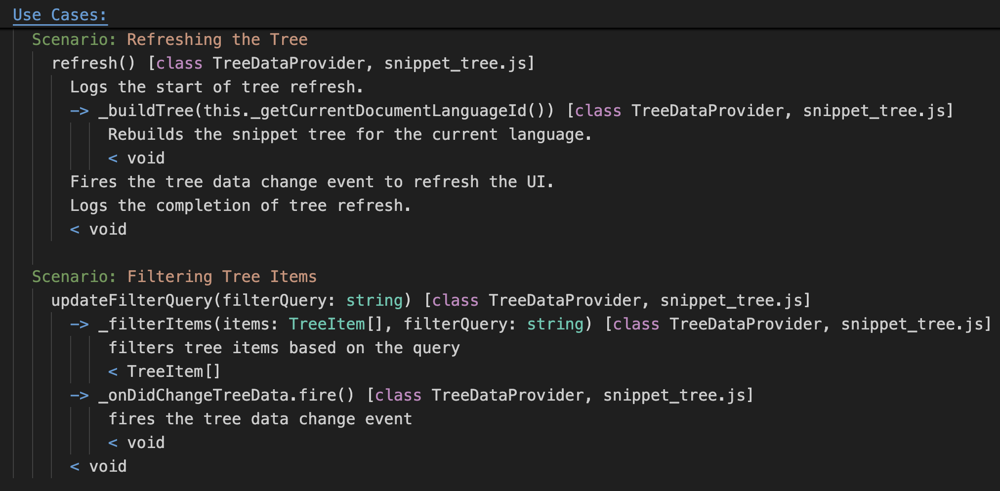

# Plain Text Diagram - Syntax Highlighting 

Syntax highlighting for `.ptd` [Plain Text Diagrams](https://abulka.github.io/blog/2025/01/29/plain-text-diagrams/) files.

PT Diagrams is a simple text notation for creating text 'diagrams' - they aren't really diagrams but are nested, indented text files that can be rapidly parsed by the human eye to gain a high level understanding of a software system.

Structural: For example classes and files are listed with their data and behaviour - try to see them as boxes. Some class relationships are indicated with arrows. 

Behavioural: Sequence 'diagrams' are constructed via an indented pseudo code format. Function calls are shown with arrows, return types are shown with `<`, and work well to indicate the flow of a use case scenario.

## Installation

- Visit https://marketplace.visualstudio.com/items?itemName=wware.plain-text-diagrams

- Or search for `plain-text-diagrams` inside vscode extensions.

Then just open a file with a `.ptd` or `.pt-diagram` extension.

## Features

Syntax highlighting for `.ptd` files.


*beginning of a PT Diagram file*


*a pseudo code, sequence diagram example of a use case scenario*

## Requirements

Just open a file with a `.ptd` or `.pt-diagram` extension.

## Extension Settings

None

## Known Issues

Some aspects of the syntax highlighting could be improved, like expressions.

Highlighting of brackets inside text descriptions is not perfect. This is because the vscode setting
```
editor.bracketPairColorization.enabled
```
is causing yellow bracket highlighting despite my grammar. In other words, its not the fault of the grammar, but the fault of the vscode setting.

Solution is to disable bracket pair colorization in your settings.json:

```json
"[ptd]": {
    "editor.bracketPairColorization.enabled": false
}
```

## Release Notes

See [CHANGELOG.md](CHANGELOG.md)

Initial release of PT Diagrams syntax highlighting.

### 0.0.2

Initial release of PT Diagrams syntax highlighting.

### 0.0.1

Alpha release of PT Diagrams syntax highlighting.

---

## PT Diagrams Syntax

See the official [Plain Text Diagrams](https://abulka.github.io/blog/2025/01/29/plain-text-diagrams/) blog post for information on PT Diagrams and the official syntax.


**Enjoy!**
